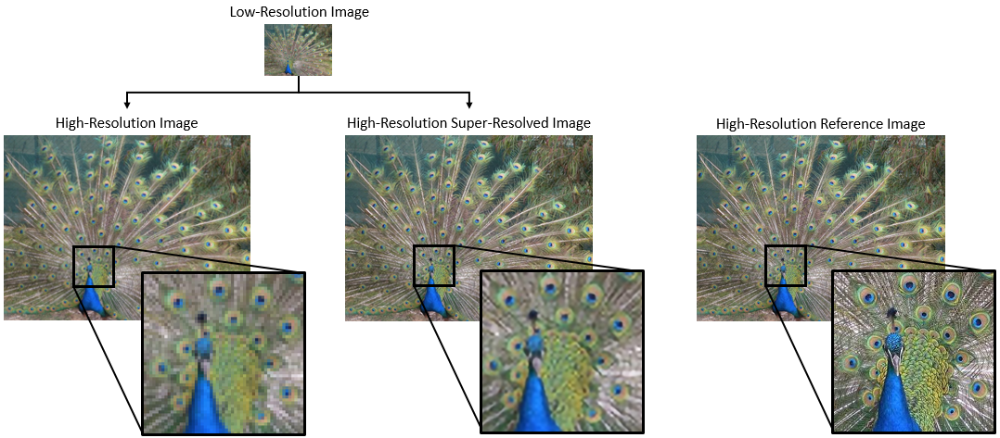
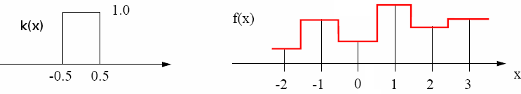
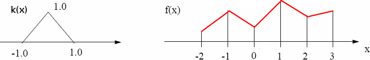

Chengliang Tang

GU4243/GR5243: Applied Data Science

## Pixel Resolution

In digital imaging, the term *resolution* often refers to the number of pixels in the image. 

The convention is to describe *pixel resolution* with the set of two positive integer numbers, where the first number is the number of pixel columns (width) and the second is the number of pixel rows (height), e.g. 3928 x 6568. Another convention is to cite resolution as the total number of pixels, typically in megapixels, which is the product of pixel columns and pixel rows and dividing by one million, e.g. iPhone Xs Dual 12 MP (megapixel) Camera.

<center>


Figure 1. Example of pixel resolution

</center>


## Image Downsampling

How to reduce the resolution of an image? Simple - throw away data.

The idea is pretty straightforward: if the original image is too large, we can throw away every other row and every other column (1st, 3rd, 5th, etc) to create a 1/2 size image.

<center>


Figure 2. Example of image downsampling

</center>


Image downsampling is the most effective way of dimension reduction, and it sometimes helps reduce noise. However, downsampled images inevitably result in information loss.

## Image Super-resolution
In many digital imaging applications, due to the limitation of hardwares, high-resolution images are usually unavailable, yet necessary for finer image processing and analysis. 

As an application to image restoration, *super-resolution* (SR) is a class of techniques that construct high-resolution (HR) images from a single or multiple observed low-resolution (LR) images. Recent development in super-resolution techniques have achieved great success in many areas, such as surveillance video, remote sensing, medical imaging and video standard conversion.

According the number of source images for each target image, super-resolution techniques can be mainly divided into two families: *single-frame super-resolution* and *multi-frame super-resolution*. In our project, we are focused on single-frame super-resolution.

<center>



Figure 3. The effects of super-resolution

</center>

### 1. Basic Algorithm: Image Interpolation

Image interpolation, the reverse of downsampling, is the most basic algorithm for super-resolution. 

How to increase the resolution of an image? Simple – replicate data. For example, the image is too small, how can we make it 10 times as big? The simplest approach is to repeat each row and column 10 times.

<center>


Figure 4. Image upsampling by repeating row and column

</center>

However, merely repeating row and columns won't recover valuable information, and the upscaled image has rough boundaries. 

We can do better!

#### 1.1. A Unified Framework
<center>


Figure 5. Image interpolation

</center>


For simplicity, we consider the case of one-dimensional images. A digital image is formed by

$$ F(x, y) = quantize \{f(x, y) \}$$
where $f(x, y)$ is the continuous natural object.

Thus, digital imaging can be described as a discrete point-sampling of a continuous function. And if we could somehow reconstruct the original function, any new image could be generated, at any resolution and scale.

Consider a concrete example for F(x) with the sample values [2, 3, 5, 4, 3, 2, 4], where the gray levels are visualized in height:

<center>


Figure 6. Example of 1-D interpolation

</center>

We want to double the size of the image F(x) to create the image G(x) 

<center>


Figure 7. Example of 1-D interpolation

</center>

Therefore, we have to determine what will be the value of the new pixels.

There are two obvious answers:

* The first answer consists in doubling each original pixels. This solution is called "replication" to the nearest neighbor because the value is the one of the nearest neighbor giving preference to the right or left neighbor for neighbors at the same distance. 

<center>


Figure 8. Example of 1-D interpolation

</center>

* The second answer consists in using the mean value of the nearest known pixels. 

<center>


Figure 9. Example of 1-D interpolation

</center>


#### 1.2. Interpolation via Convolution

In practice, image interpolation is implemented by convolution. The convolution defines a general principle for the interpolation. The interpolation kernel $k(i)$ defines the neighborhood to be considered and the weight assigned to them for calculating the value of the central pixel. Mathematically, this corresponds to the operation:

$$ G(x) = \sum_{i}F(x+i) \cdot k(i) $$

The two interpolation methods in 1.1 can both be described by a kernel.

The simplest kernel is the nearest neighbor kernel, which corresponds to a box. It produces images with blocky effect.

<center>



Figure 10. Nearest neighbor kernel

</center>

Linear interpolation use a convolution kernel k(x) which has the shape of a triangle. The output image thus has a smoother surface because the discretization is less strong.

<center>



Figure 11. Linear kernel

</center>

The most frequently used kernel are B-splines. A B-spline of degree 1 is formed by a series of straight lines, and therefore corresponds to a bilinear kernel. A B-spline of degree 2 is composed of a series of parabolic curves and B-spline of degree 3 is composed of cubic curves.

<center>


Figure 12. B-spline kernel

</center>

Here are the 2-dimensional generalization of these kernels

<center>


Figure 13. 2D kernels

</center>


#### 1.3. R/Python Examples

In R, we can use `resize` from package `Imager` to try different image interpolation kernels

```
> library(imager)
> img <- load.image('test.jpg')
> ## nearest neighbor interpolation
> im_1 <- resize(img, 500, 500, interpolation_type = 1)
> ## linear interpolation
> im_2 <- resize(img, 500, 500, interpolation_type = 3)
> ## cubic interpolation
> im_3 <- resize(img, 500, 500, interpolation_type = 5)
```

In Python, similar function is realized by OpenCV

```
import cv2
img = cv2.imread('test.jpg')
## nearest neighbor
im_1 = cv2.resize(img, (500, 500), interpolation = cv2.INTER_NEAREST)
## linear interpolation
im_2 = cv2.resize(img, (500, 500), interpolation = cv2.INTER_LINEAR)
## cubic interpolation
im_3 = cv2.resize(img, (500, 500), interpolation = cv2.INTER_CUBIC)
```
<center>


Figure 14. Comparisons of different kernels

</center>

### 2. Baseline Algorithm: Patch-based Method

Can we even do better? Yes!

In the previous section, all the kernels are 'data-free', saying their weights are fixed and independent of the images. Yet with predictive modeling, we are able to learn 'better' weights from training data. 

In this project, the goal is to generate a high-resolution image twice as big for each test image, i.e. number of rows and number of columns are both doubled. The baseline patch-based algorithm is to build low/high-resolution patch pairs, and learn the best mapping between them.


<center>


Figure 15. Baseline method workflow

</center>


#### 2.1. Feature Construction

As shown in the above figure, if our goal is to create a twice as big high-resolution version of the original image, it is equivalent to split each pixel into four sub-pixels.

In general, given low and high-resolution image patches $I_{LR}$ and $I_{HR}$ with sizes $D \times D$ and $U \times U$ ($D = 3, U = 2$ in the example), respectively, to superresolve the center pixel of $I_{LR}$ by a factor of $U$ , we define vectors

$$ x = \text{vectorize}(I_{LR}) - \text{center pixel}(I_{LR}) \in \mathbb{R}^{D^2 \times 1}$$
and

$$ y = \text{vectorize}(I_{HR}) - \text{center pixel}(I_{LR}) \in \mathbb{R}^{U^2 \times 1}$$

in a given training set $\Omega$ of $(x_i, y_i)$ pairs. The task at hand has been transformed into a regression problem.


#### 2.2. Predictive Algorithm

This is a multiple output regression problem and in the literature it is often solved as separate single output regressions. Recently, there has been some work on learning vector valued function, but we adopt the traditional method of treating multiple output regression problems as separate single output regression problems for each output dimension. Therefore, learning the four outputs becomes $y_j = g_j(x)$ for $j = 1, ..., 4$, given the input $x \in \mathbb{R}^{D^2 \times 1}$, and $g_j$ is estimated by GBM.

#### 2.3. Performance Measure
In image super-resolution, the most used performance measure is *Peak Signal-to-noise Ratio*, often abbreviated PSNR. It is an engineering term for the ratio between the maximum possible power of a signal and the power of corrupting noise. In practice, PSNR is most easily defined via the mean squared error (MSE). Given a noise-free $m \times n$ colorful image $I$ and its noisy approximation $K$, MSE is defined as:

$$ MSE = \frac{1}{3mn} \sum_{c = 1}^{3}\sum_{i = 1}^{m}\sum_{j=1}^{n}[I(i, j, c) - K(i, j, c)]^2$$
Then, PSNR (in dB) is defined as

$$ PSNR = 20 \cdot \text{log}_{10}(MAX_I) - 10 \cdot \text{log}_{10}(MSE)$$
where $MAX_I$ is the maximum possible pixel value (255 or 1) of the image.

### 3. Advanced Algorithm
In this part, we identify several areas of potential improvement.

#### 3.1. Feature & Predictor
In baseline method, we only use the first outside layer (8 pixels) of each pixel to construct training features, and make predictions using GBM. What about a larger neighborhood and a different predictor? 

Also, there is some work on learning vector valued functions, which might alleviate your computational burdens of building twelve predictors.


#### 3.2. Keypoints Detection
In patch-based methods, it is often impractical to create a training feature $x$ for each pixel. Let's do a simple calculation. Suppose each image is of the same size 200 x 200, creating a feature for each pixel would result in a feature matrix of 40000 rows, and this number quickly explodes with the increasing size of image set!

According to Shannon's sampling theorem, for better sampling efficiency, we should have a higher sample rate for high frequency signals, and can have a relatively lower sample rate for high frequency signals. In image analysis, you can think of frequency as the rate of color change. Therefore, we should give more sample weight to areas where color changes drastically, e.g. corners, boundaries.

<center>


Figure 16. Left: raw image; Right: gray-scale image withSIFT keypoints

</center>

Image keypoint detection has been a hot research topic in the last 20 years, and there are a bunch of computer vision algorithms for this task, e.g. Laplacian detector, Harris detector, scale-invariant feature transform (SIFT), etc.

#### 3.3. Deep Learning
<center>


Figure 17. Architecture of Super-resolution Convolutional Neural Network (SRCNN)

</center>

Image super-resolution with deep learning is one of the most active research areas in computer vision. It has been shown the patch-based algorithm is equivalent to a deep convolutional neural network. 

Thus, one area for potential improvement is to learn an end-to-end mapping between the low/high-resolution images. The mapping is represented as a deep convolutional neural network (CNN) that takes the low-resolution image as the input and outputs the high-resolution one. Also, deep learning libraries such as `Tensorflow` enable you to efficiently build your deep learning architecture in R/Python.

## References 

1. Ni, K. S., & Nguyen, T. Q. (2007). Image superresolution using support vector regression. *IEEE Transactions on Image Processing*, 16(6), 1596-1610. [pdf](http://citeseerx.ist.psu.edu/viewdoc/download?doi=10.1.1.649.9341&rep=rep1&type=pdf)
(This paper is the source of our baseline method, where GBM is replaced by SVR.)

2. Yang, C. Y., Ma, C., & Yang, M. H. (2014, September). Single-image super-resolution: A benchmark. *In European Conference on Computer Vision* (pp. 372-386). Springer, Cham. [pdf](https://www.researchgate.net/profile/Ming-Hsuan_Yang2/publication/278693824_Single-Image_Super-Resolution_A_Benchmark/links/56f46be708ae38d7109f6b85/Single-Image-Super-Resolution-A-Benchmark.pdf) (This paper compares different super-resolution algorithms on benchmark set.)

3. Maalouf, A., & Larabi, M. C. (2013). Image super-resolution, a state-of-the-art review and evaluation. *In Advanced Color Image Processing and Analysis* (pp. 181-218). Springer, New York, NY. [pdf](https://link.springer.com/content/pdf/10.1007%2F978-1-4419-6190-7_7.pdf) (A review for image super-resolution algorithms.)

3. Dong, C., Loy, C. C., He, K., & Tang, X. (2016). Image super-resolution using deep convolutional networks. *IEEE transactions on pattern analysis and machine intelligence*, 38(2), 295-307.
[pdf](https://arxiv.org/pdf/1501.00092.pdf), [codes](http://mmlab.ie.cuhk.edu.hk/projects/SRCNN.html) (This paper popularized CNN architectures for image super-resolution. Almost all the subsequent state-of-the-art approaches on super-resolution adopted this paradigm.)


## Image Source

Figure 1 is from Wikipedia (https://en.wikipedia.org/wiki/File:Resolution_illustration.png)

Figure 2 is from http://www.cs.toronto.edu/~fidler/slides/2015/CSC420/lecture5.pdf

Figure 3 is from https://www.mathworks.com/help/images/single-image-super-resolution-using-deep-learning.html

Figure 6 ~ 12 is from the tutorial by Pantheon Project (https://clouard.users.greyc.fr/Pantheon/experiments/rescaling/index-en.html)

Figure 13 is from Wikipedia (https://upload.wikimedia.org/wikipedia/commons/9/90/Comparison_of_1D_and_2D_interpolation.svg)

Figure 17 is from *Image super-resolution using deep convolutional networks* (https://arxiv.org/pdf/1501.00092.pdf)


