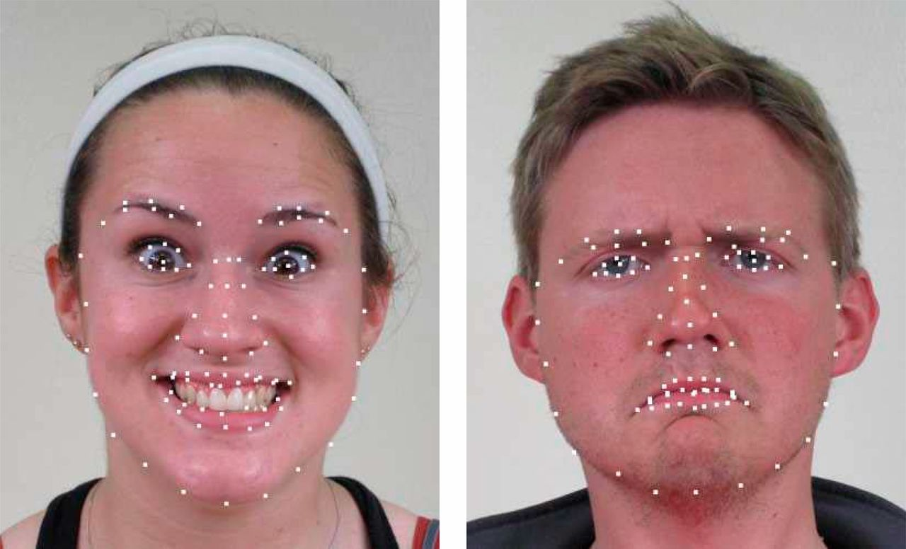

# Project: Can you recognize the emotion from an image of a face? 

(Image source: https://www.pnas.org/content/111/15/E1454)

### [Full Project Description](doc/project3_desc.md)

Term: Spring 2021

+ Team ##
+ Team members
	+ team member 1
	+ team member 2
	+ team member 3
	+ team member 4
	+ team member 5

+ Project summary: In this project, we created a classification engine for facial emotion recognition. 
	
**Contribution statement**: ([default](doc/a_note_on_contributions.md)) All team members contributed equally in all stages of this project. All team members approve our work presented in this GitHub repository including this contributions statement. 

Following [suggestions](http://nicercode.github.io/blog/2013-04-05-projects/) by [RICH FITZJOHN](http://nicercode.github.io/about/#Team) (@richfitz). This folder is orgarnized as follows.

```
proj/
├── lib/
├── data/
├── doc/
├── figs/
└── output/
```

Please see each subfolder for a README file.
