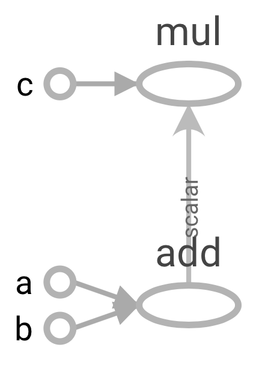

```{r setup, include=FALSE}
knitr::opts_chunk$set(echo = TRUE)
```


> A popular deep learning framework. The R interface makes it possible to train neural networks in R.

<div style="text-align: center;" align = "center">
  <span class="slide" style="float:center;width: 80%;">
  
  </span>
</div>


To learn more about the R interface, see [website](https://tensorflow.rstudio.com).  

To learn more about Tensorflow, see [website](https://www.tensorflow.org)

</br>

# 1 Installation
***
</br>


```{r,eval=FALSE}
install.packages("tensorflow")
library(tensorflow)
```

</br>
</br>

# 2 Environment
***
</br>

Note that unlike other packages in R, Tensorflow needs an environment with Python to work on with. Two options are available.

__Option 1__ 

Select your existing environment with Python & Tensorflow in it with `use_python()`,`use_virtualenv()` or `use_condaenv()` function. [Learn more](https://tensorflow.rstudio.com/tensorflow/articles/installation.html#custom-installation)


__Option 2__ 

Let R create a new environment with Python & Tensorflow for you using the code below.

</br>

```{r,eval=FALSE}
install_tensorflow()
```


</br>

# 3 To Start with
*** 

</br>

Tensorflow contains some low-level APIs and high-level APIs. 

* The **low-level APIs**, also called its **core**, help us to build our model almost from scratch. 

* The **high-level APIs**, such as `keras`, help us to train a deep learning model in a much easier way.

Although it is convenient to use high-level APIs for a beginner to build models, practicing some low-level APIs give us a better understanding of how Tensorflow works. Debugging also becomes straightforward when it comes to the low-level.


</br>


# 4 Learn from scratch
*** 
</br>

Before start coding, introducing some important concepts might be helpful.

</br>

## 4.1 Computation graph
*** 

As is suggested by the name "Tensorflow", the idea of the framework is to build a computation graph as the model using **tensors**.

First, we need to understand what is a  **computation graph**.


</br>

<div style="text-align: center;" align = "center">
  <span class="slide" style="float:center;width: 80%;">
  
  </span>
</div>
<center>
Figure 1. Example of computation graph
</center>
</br>


In a computation graph,  **variables**,**constant**,**operations** are represented by nodes. The direction of edges represent the computation flow. Thus a computation graph is usually a **DAG**(directed acyclic graph).

The computation graph has the advantage of **parallel computation**, which makes compution more efficient using several CPUs/GPUs. This could be illustrated below.

</br>

<div style="text-align: center;" align = "center">
  <span class="slide" style="float:center;width: 80%;">
  
  </span>
</div>

<center>
Figure 2. Example of parallel computation
</center>
</br>

[Learn more in Andrew Ng's Deep Learning course](https://www.coursera.org/lecture/neural-networks-deep-learning/computation-graph-4WdOY)

</br>

Similarly, Tensorflow helps us to build a computation graph using nodes(tensors) as building blocks. The tuning process of a model(whether a neural network model or not) could be viewed as the change of parameters in this computation graph.

</br>


## 4.2 Building blocks
*** 

Usually, the building process and computation process is done in a **session**, which is an instance encapsulates the required environment. Thus after defining the tensors, we must open the session to start computing. We also need to close the session after the computation.

Here's a simple example for the session.
</br>

### Step 1: Defining nodes

Let's create a **constant** node as the first example.

Note that the symbol `.` in the Python language is replaced by `$` in R.

```{r,eval=FALSE}
hello <- tf$constant('Hello, TensorFlow!')
```
</br>

Other commonly used two types of Tensorflow nodes containing values are:

* `tf.Variable`: Helps to store a variable(the value could be changed during the computation). This is the most common one used when doing machine learning.

* `tf.placeholder`: Helps to store a value which is post-defined when feeding it to the graph using `feed_dict`.

</br>

### Step 2: Defining session

```{r,eval=FALSE}
sess <- tf$Session()

```
</br>

### Step 3: Running session

```{r,eval=FALSE}
sess$run(hello)

```
</br>


### Step 4: Closing session

Note that we must remember to close the session after we finish the computation. Problems may arise in a new computation if you forget to shut down the previous.

```{r,eval=FALSE}
sess$close()
```

</br>

## 4.3 A simple example
*** 

Now we could start to build a simple computation graph.

```{r,eval=FALSE}
a <- tf$constant(1, dtype=tf$float32, name='a')
b <- tf$constant(1, dtype=tf$float32, name='b')
add <- tf$add(a, b, name='add') # same as a+b
c <- tf$constant(5, dtype=tf$float32, name='c')
mul <- tf$multiply(add, c, name='mul') # same as c*(a+b)


```
</br>

Print the result of our computation. This will output a list [1,1,5,2,10].
</br>

```{r,eval=FALSE}
sess <- tf$Session()
print(sess$run(c(a,b,c,add,mul)))
writer <- tf$summary$FileWriter("output",sess$graph)
writer$close()
sess$close()

```


`tensorboard` is a visulization tool provided by Tensorflow. We could use it to view the structure of our computation graph. Images could also be downloaded to your local file after open it in your browser.


</br>

<div style="text-align: center;" align = "center">
  <span class="slide" style="float:center;width: 60%;">
  
  </span>
</div>
<center>
Figure 3. Example of Tensorboard
</center>
</br>


```{r,warning=FALSE,eval=FALSE}
tensorboard("output")

```

Click on the `graph` tag to view the structure of our model.

Then we could get some thing like this.

</br>

<div style="text-align: center;" align = "center">
  <span class="slide" style="float:center;width: 80%;">
  
  </span>
</div>
<center>
Figure 4. Graph structure of our example
</center>
</br>


### Useful reference
[Image interpolation with Tensorflow](https://jyr123456.shinyapps.io/Image_Interpolation_tutorial/)
</br>
</br>

[More about low-level APIs](https://www.tensorflow.org/guide/low_level_intro)
</br>
</br>

[Tensorflow core functions for Python](https://www.tensorflow.org/api_docs/python/tf)
</br>
</br>


# 5 High-level API
*** 
</br>

There are some high-Level APIs available for Tensorflow. We will introduce `keras`, which is the most popular one to train neural networks.

## 5.1 Installation
*** 

We could install Keras the same way as Tensorflow. Unlike the low-level APIs provided by tensorflow core, Keras is more user-friendly and easier to handle.(Especially when training deep learining models, which is difficult for beginners to start from scratch.)

</br>

```{r,eval=FALSE}
devtools::install_github("rstudio/keras")
library("keras")
install_keras()

```

## 5.2 A simple example
*** 

We use will use the dataset "iris" as an example data set. We are going to train a model which predicts the iris' speices using its Sepal Length, Sepal Width, Petal Length, Petal Width as predictors.

Here are pictures for different iris:


<div style="text-align: center;" align = "center">
  <span class="slide" style="float:center;width: 100%;">
  
  </span>
</div>

<center>
Figure 5. Different kinds of iris
</center>
</br>

### Step 1: Data processing

Fetch the data online.
```{r,eval=FALSE}
iris <- read.csv(url("http://archive.ics.uci.edu/ml/machine-learning-databases/iris/iris.data"), header = TRUE) 

```
</br>

Let's split the dataset into training/test set.

Normalization could also be applied to dataset using `normalize()` function provided by Keras. While in this example this step is not necessary.
</br>

```{r,eval=FALSE}
ind <- sample(2, nrow(iris), replace=TRUE, prob=c(0.67, 0.33))

# Split the `iris` data
iris.training <- data.matrix(iris[ind==1, 1:4])
iris.test <- data.matrix(iris[ind==2, 1:4])

# Split the class attribute
iris.trainingtarget <- iris[ind==1, 5]
iris.testtarget <- iris[ind==2, 5]


```
</br>

For this multi-class classification problem, we need to transform the category type from "factor" to "integer"(indicator). This is also called the **one-hot encoding**.  e.g. $[1,0,0]$ indicates Setosa, $[0,1,0]$ indicates Versicolor, $[0,0,1]$ indicates Virginica. Thus the output label could be a $n\times3$ matrix. 

Fortunately, Keras provides a function `to_categorical()` for doing this.
</br>

```{r,eval=FALSE}

iris.trainLabels <- to_categorical(as.numeric(iris.trainingtarget))[,-1]

iris.testLabels <- to_categorical(as.numeric(iris.testtarget))[,-1]


```
</br>

### Step 2: Model building

We could now start to build our sequential model by adding layers and compile it.
</br>

```{r,eval=FALSE}
model <- keras_model_sequential()
# Add layers to the model
model %>% 
  layer_dense(units = 8, activation = 'relu', input_shape = c(4)) %>% 
  layer_dense(units = 3, activation = 'softmax')

summary(model)

model %>% compile(
  loss = 'categorical_crossentropy',
  optimizer = 'adam',
  metrics = 'accuracy'
)

```

</br>

### Step 3: Model training and tunning parameters

Some important concepts for NN training:

* **batch size**: the number of training samples in one forward/backward pass.

* **epoch**: one forward and backward pass for all training samples.

* **iterations**: number of passes, each pass using [batch size] number of training samples.


These nice explanations come from [here](https://stackoverflow.com/questions/4752626/epoch-vs-iteration-when-training-neural-networks).


For this example, we set the epoch number to be 200, batch size to be 5. Let's say there are 100 training sample. In this case, we need to run $\frac{100}{5}\times 200 = 4000$ iterations.

</br>


```{r,warning=FALSE,eval=FALSE}

model %>% fit(
  iris.training, 
  iris.trainLabels, 
  epochs = 200, 
  batch_size = 5, 
  validation_split = 0.2,
  callbacks = callback_tensorboard("logs/run_a")
)

tensorboard("logs/run_a")
```
</br>

Here's the training history of our model. We could also open tensorboard to view the structure of our model.


<div style="text-align: center;" align = "center">
  <span class="slide" style="float:center;width: 90%;">
  
  </span>
</div>
<center>
Figure 6. Training history of the example 
</center>
</br>


<div style="text-align: center;" align = "center">
  <span class="slide" style="float:center;width: 90%;">
  
  </span>
  <center>
Figure 7. Graph structure visualization
</center>
</div>


### Step 4: Model prediction and evaluation

We could use `predict_classes` function to return the prediction of our test set.
</br>

```{r,eval=FALSE}
classes <- model %>% predict_classes(iris.test, batch_size = 128)

```
</br>

`evaluate` function to returns the accuracy and loss of our model.
</br>

```{r,eval=FALSE}
score <- model %>% evaluate(iris.test, iris.testLabels, batch_size = 128)
print(score)

```
</br>

This returns a confusion matrix.
</br>

```{r,eval=FALSE}
table(iris.testtarget, classes)

```

<div style="text-align: center;" align = "center">
  <span class="slide" style="float:center;width: 90%;">
  
  </span>
</div>


Our tutorial ends here.


# 6 More


### Datacamp tutorial using iris dataset
[Reference](https://www.datacamp.com/community/tutorials/keras-r-deep-learning)
</br>
The final parts of the tutorial borrowed the example from here.
</br>
</br>

### How to use pre-trained models
[Reference(Python)](https://www.kernix.com/blog/image-classification-with-a-pre-trained-deep-neural-network_p11)

[Reference(R)](https://tensorflow.rstudio.com/keras/articles/applications.html)
</br>
</br>

### More about Tensorboard
[Reference](https://www.datacamp.com/community/tutorials/tensorboard-tutorial)
</br>
</br>

### More about Keras
[Reference](https://tensorflow.rstudio.com/keras/articles/guide_keras.html)
</br>
</br>


### Deep Learning by MIT press
[Reference](https://www.deeplearningbook.org)
</br>
</br>


## More things need to be explored ...
</br>
</br>

# Other Resources
[Cheatsheet](https://github.com/kailashahirwar/cheatsheets-ai/blob/master/PDFs/Tensorflow.pdf)

[Tensorflow GPU version for R](https://tensorflow.rstudio.com/tools/local_gpu.html)

[Google Cloud Platform](https://cloud.google.com/getting-started/)

</br>
</br>

# Image Source
Figure 1~2 is from https://www.simplilearn.com/introduction-to-tensorflow-tutorial

Figure 5 is from https://www.datacamp.com/community/tutorials/keras-r-deep-learning

