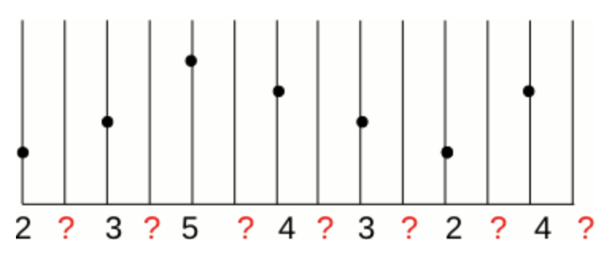

```{r setup, include=FALSE}
knitr::opts_chunk$set(echo = TRUE)
```


> A popular deep learning framework. The R interface makes it possible to train neural networks in R.

<div style="text-align: center;" align = "center">
  <span class="slide" style="float:center;width: 80%;">
  
  </span>
</div>


To learn more about the R interface, see [website](https://tensorflow.rstudio.com).  

To learn more about Tensorflow, see [website](https://www.tensorflow.org)

</br>

# 1 Installation & Basic oepration
***
</br>

[Link to another tutorial](https://jyr123456.shinyapps.io/Tensorflow_tutorial/)

</br>
</br>

# 2 Introduction
***
</br>

Tensorflow is a perfect tool for building neural networks. Moreover, we could use it to build all kinds of computational graphs. Solving different problems by building up the Tensors, we could easily learn the "Tensorflow" way of thinking.

Since neural networks are so popular in computer vision, implementing an interesting algorithm called **image interpolation** is a good practice.

</br>


# 3 Image interpolation
*** 
</br>
[Basic tutorial](https://cdn.rawgit.com/TZstatsADS/ADS_Teaching/master/Tutorials/wk7-SuperResolution/super_resolution.html)

</br>

## 3.1 1-D linear interpolation
</br>

For 1-D linear implementation, here is a good visualization of the theoretical computation described above.

<div style="text-align: center;" align = "center">
  <span class="slide" style="float:center;width: 80%;">
  
  </span>
</div>


<div style="text-align: center;" align = "center">
  <span class="slide" style="float:center;width: 80%;">
  
  </span>
</div>
<center>
Figure 1. 1-D interpolation visualization
</center>

</br>

## 3.2 2-D linear interpolation
</br>

Since the images we are going to process are 2-D, it's easy to visualize the result of 2-D interpolation.

<div style="text-align: center;" align = "center">
  <span class="slide" style="float:center;width: 80%;">
  
  </span>
</div>
</br>

<center>
Figure 2. 2-D interpolation visualization
</center>

</br>


For 2-D linear interpolation, we need a more complex computation process since each pixel we fill depends on more values and the distance measure comes to two dimension.

The figure below shows the way to calculate the interpolation value for the output image.

<div style="text-align: center;" align = "center">
  <span class="slide" style="float:center;width: 80%;">
  
  </span>
</div>

<center>
Figure 3. Calculation of 2-D interpolation values
</center>
</br>


# 4 Tensorflow implementation
***
</br>

## 4.1 Computational graph intuition
</br>

Suppose we need to enlarge image **2** times as before.
</br>

<div style="text-align: center;" align = "center">
  <span class="slide" style="float:center;width: 80%;">
  
  </span>
</div>

<center>
Figure 4. 2-D interpolation values when size equals two
</center>

</br>

If we use the idea provided above, for each $2\times2$ input of the original image pixels, we need to output a $3\times3$ pixel matrix.

Tensorflow provides efficient operations on matrix manipulation, thus it's intuitive to use vectorized calculation.


\[
\begin{bmatrix}
1 & 0\\
\frac{1}{2} & \frac{1}{2}\\
0 & 1
\end{bmatrix}\times
\left(
\begin{bmatrix}
\text{input_1} & \text{input_2}\\
\text{input_3} & \text{input_4}
\end{bmatrix}\times
\begin{bmatrix}
1 & \frac{1}{2} & 0\\
0 & \frac{1}{2} & 1
\end{bmatrix}\right)
\]

Each of the input and the calculation step provided above could be represented by a Tensor.

Follow this step, we could easily obtain the transition matrix in case $\times n$. This part is left as an exercise.

</br>

## 4.2 Code implementation
</br>


```{r,eval=FALSE}
library(tensorflow)


```
</br>

### Step 1: Graph construction
</br>


First we need two tensors for the input data.

```{r,eval=FALSE}
data_tf <- tf$placeholder(tf$float32,shape(2,2))
size_tf <- tf$placeholder(tf$int32)

```
</br>

Construct the transition matrix with the input value of size. We need **operation tensors** doing this.

```{r,eval=FALSE}
seq_tf <- tf$linspace(start=1.0, stop=0.0, num=size_tf+1L)
flipseq_tf <- tf$linspace(start=0.0, stop=1.0, num=size_tf+1L)
mat1_tf <- tf$concat(list(list(seq_tf),list(flipseq_tf)),axis=0L)
mat2_tf <- tf$transpose(mat1_tf)

```
</br>

Two more operation tensors for matrix multiplication.

```{r,eval=FALSE}
h1_tf <- tf$matmul(data_tf,mat1_tf)
out_tf <- tf$matmul(mat2_tf,h1_tf)

```
</br>

Define the output, actually you could include more if you want.

```{r,eval=FALSE}
tf_output <- out_tf

```
</br>

### Step 2: Data loading
</br>

The package `JPEG` allows us to load in jpg image file into numerical type.


```{r,eval=FALSE}
library(jpeg)
chicken <- readJPEG("example.jpg")
plot(c(0,1),c(0,1))
rasterImage(chicken,0, 0, 1, 1)

```
</br>

The chicken image has a ground truth image with size $600\times600$. To test our algorithm implementation, we downsampled it into size $50\times50$.

<div style="text-align: center;" align = "center">
  <span class="slide" style="float:center;width: 80%;">
  
  </span>
</div>
<center>
Figure 5. Example image
</center>

</br>

### Step 3: Graph computing
</br>

Define functions for graph computing.

```{r,eval=FALSE}

blinear_interpolation <- function(original_pic,times){
  orignal_size <- dim(original_pic[,,1])[1]
  a <- orignal_size
  b <- times
  new_pic <- array(,c(a*b-b+1,a*b-b+1,3))
  sess <- tf$Session()
  for(d in 1:3){
    original_channel_data <- original_pic[,,d]
    new_channel_data <- matrix(,nrow=a*b-b+1, ncol = a*b-b+1)
    for (i in 1:(a-1)){
      for (j in 1:(a-1)){
        start_x <- i
        end_x <- i+1
        start_y <- j
        end_y <- j+1
        this.data <- original_channel_data[start_x:end_x,start_y:end_y]
        out <- sess$run(tf_output,feed_dict = dict(data_tf = this.data,size_tf = b))
        new_channel_data[(b*i-b+1):(b*i+1),(b*j-b+1):(b*j+1)] <- out
      }
      cat("row",i,"finished!","\n")
    }
    cat("channel",d,"finished!","\n")
    new_pic[,,d] = new_channel_data
  }
  sess$close()
  return(new_pic)
}

```
</br>

Suppose we are going to make the picture **8** times the size as before.

```{r,eval=FALSE}
new_pic <- blinear_interpolation(chicken,8)
```
</br>

### Step 4: Output image
</br>

Then we could take a look at the change.

```{r,eval=FALSE}
par(mfrow=c(1,2))

plot(c(0,1),c(0,1),type=n)
rasterImage(chicken,0, 0, 1, 1)

plot(c(0,1),c(0,1),type=n)
rasterImage(new_pic,0, 0, 1, 1)

```
</br>

Actually we could try different values of size. Here's what we get using a list of values.
</br>


<div style="text-align: center;" align = "center">
  <span class="slide" style="float:center;width: 80%;">
  
  </span>
</div>

<center>
Figure 6. Output image for different values in size
</center>

</br>

</br>


<div style="text-align: center;" align = "center">
  <span class="slide" style="float:center;width: 80%;">
  
  </span>
</div>

<center>
Figure 7. Comparison with the down-sampled original image
</center>

</br>
</br>

The code below helps you save your processed image to local file.

```{r,eval = FALSE}

writeJPEG(new_pic,target = "linear_interpolation_8.jpg")


```
</br>


Our tutorial ends here.
</br>
</br>


# 5 More

### More about low-level APIs
[Reference](https://www.tensorflow.org/guide/low_level_intro)
</br>
</br>

### Tensorflow core functions for Python
[Reference](https://www.tensorflow.org/api_docs/python/tf)
</br>
</br>

### How to use pre-trained models
[Reference(Python)](https://www.kernix.com/blog/image-classification-with-a-pre-trained-deep-neural-network_p11)

[Reference(R)](https://tensorflow.rstudio.com/keras/articles/applications.html)
</br>
</br>


### Deep Learning by MIT press
[Reference](https://www.deeplearningbook.org)
</br>
</br>


## More things need to be explored ...
</br>
</br>

# Other Resources
[Tensorflow Cheatsheet](https://github.com/kailashahirwar/cheatsheets-ai/blob/master/PDFs/Tensorflow.pdf)

[Tensorflow GPU version for R](https://tensorflow.rstudio.com/tools/local_gpu.html)

[Google Cloud Platform](https://cloud.google.com/getting-started/)

</br>

# Image Source
Figure 1 is from https://cdn.rawgit.com/TZstatsADS/ADS_Teaching/master/Tutorials/wk7-SuperResolution/super_resolution.html

Figure 2 is from https://www.pygimli.org/_tutorials_auto/1_basics/plot_5-mesh_interpolation.html

Figure 3~4 is from http://www.di.univr.it/documenti/OccorrenzaIns/matdid/matdid358544.pdf

The Chicken image comes from https://github.com/TZstatsADS/ADS_Teaching/tree/master/5-Spring2018/Projects_StarterCodes/Project3_PoodleKFC
