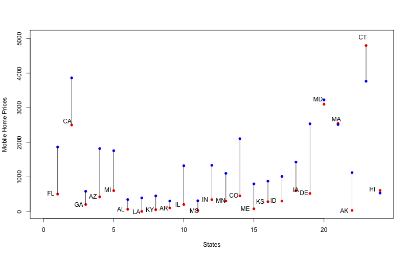

## Tutorial: data manipulation

In this Rmarkdown presentation, we will explore the 2013 American Community Survey data set.

- `knitr` and Rmarkdown
- The `dplyr` package
- The `googleVis` package

## Load the libraries

```{r, message=F}
library(dplyr)
load("../data/husa.RData")
```

## Basic information about data
```{r,message=F}
dim(acs13husa)
```

## Using survey weights
- In this data set, there are some weight variables. 
- This is because American Community Survey is based on a stratified household sample, rather than a simple random sample. 
- To adjust for the unequal selection probability of individuals, weights are introduced. 
- We should use `WGTP` for estimates. 
- And use weight replicates `wgtp1`-`wgtp80` for standard error estimates. 
- Reference: https://usa.ipums.org/usa/repwt.shtml

## The `dplyr` package
Dplyr aims to provide a function for each basic verb of data manipulation.

- `filter()`
- `arrange()`
- `select()`
- `distinct()`
- `mutate()`
- `summarise()`
- `sample_n()` and `sample_frac()`


## Add state names and abbreviations

```{r, message=F}
ST.anno=read.csv("../data/statenames.csv")
acs13husa=mutate(acs13husa, STname=ST.anno[ST, 2], 
                 STabbr=ST.anno[ST, 3])
select(sample_n(acs13husa,5), starts_with("ST"))
```

## Pipeline operator

The same codes above can be re-arranged using the pipeline operator `%>%` to improve readability of your codes. 

```{r, message=F}
acs13husa%>%
  sample_n(5) %>%
  select(starts_with("ST"))
```

## Pipeline basic analysis

```{r, message=F}
mobilehome=
  acs13husa %>%
  filter(BLD == 1) %>%
  group_by(STabbr) %>%
  summarize(
    AvgPrice = mean(MHP, na.rm=T),
    MedianPrice = as.numeric(median(MHP, na.rm=T)),
    Count = n()
  ) %>%
  arrange(desc(Count))
```

## Simple plot

```{r, message=FALSE, fig.height=4, fig.width=7}
barplot(mobilehome$Count, names.arg=mobilehome$STabbr, 
        cex.names=0.4)
```

## Simple plot

```{r, message=FALSE, eval=FALSE}
plot(c(0,nrow(mobilehome)), 
     c(min(mobilehome$MedianPrice), 
       max(mobilehome$MedianPrice)*1.05), type="n",
     xlab="States",
     ylab="Mobile Home Prices")
points(1:nrow(mobilehome), mobilehome$MedianPrice, col=2, pch=16)
points(1:nrow(mobilehome), mobilehome$AvgPrice, col=4, pch=16)
segments(1:nrow(mobilehome), mobilehome$MedianPrice,
      1:nrow(mobilehome), mobilehome$AvgPrice)
text(1:nrow(mobilehome), mobilehome$MedianPrice*1.05, 
     mobilehome$STabbr)
```
## Simple plot
```{r, message=FALSE, include=FALSE}
png("../figs/AvgMed.png", width=800, height=500)
plot(c(0,nrow(mobilehome)), 
     c(min(mobilehome$MedianPrice), 
       max(mobilehome$MedianPrice)*1.05), type="n",
     xlab="States",
     ylab="Mobile Home Prices")
points(1:nrow(mobilehome), mobilehome$MedianPrice, col=2, pch=16)
points(1:nrow(mobilehome), mobilehome$AvgPrice, col=4, pch=16)
segments(1:nrow(mobilehome), mobilehome$MedianPrice,
      1:nrow(mobilehome), mobilehome$AvgPrice)
text(1:nrow(mobilehome), mobilehome$MedianPrice*1.05, 
     mobilehome$STabbr)
dev.off()
```



## Put together summary data
In part a, we have 25 states.
```{r, message=F}
ST.incld=unique(acs13husa$ST)
ST.abbr=ST.anno[ST.incld, 3]
ST.abbr
```

## Put together summary data
```{r, message=F}
VALP.sum=summarise(group_by(acs13husa, ST), 
                     weighted.mean(VALP, WGTP, na.rm=T))
FINCP.sum=summarise(group_by(acs13husa, ST), 
                     weighted.mean(FINCP, WGTP, na.rm=T))
MRGP.sum=summarise(group_by(acs13husa, ST), 
                     weighted.mean(MRGP, WGTP, na.rm=T))
sum.data=data.frame(abbr=ST.abbr, 
                    VALP=unlist(VALP.sum[,2]),
                    FINCP=unlist(FINCP.sum[,2]),
                    MRGP=unlist(MRGP.sum[,2]))
sum.data[,-1]=round(sum.data[,-1], digits=2)
```

## Simple Google Visualization

We will use the `googleVis` package to achieve simple interactive visualization (it requires internet connectivity).

```{r, message=F}
library(googleVis)
op <- options(gvis.plot.tag='chart')
Bubble <- gvisBubbleChart(sum.data, idvar="abbr", 
                          xvar="FINCP", yvar="VALP",
                          colorvar="",
                          sizevar="MRGP",
                          options=list(width="600px", 
                                       height="600px",
                                       sizeAxis = '{minValue: 0,
                                       maxSize: 15}'))
```

## Simple Google Visualization
```{r, results='asis', tidy=TRUE, message=FALSE, fig.width=4}
plot(Bubble)
```
