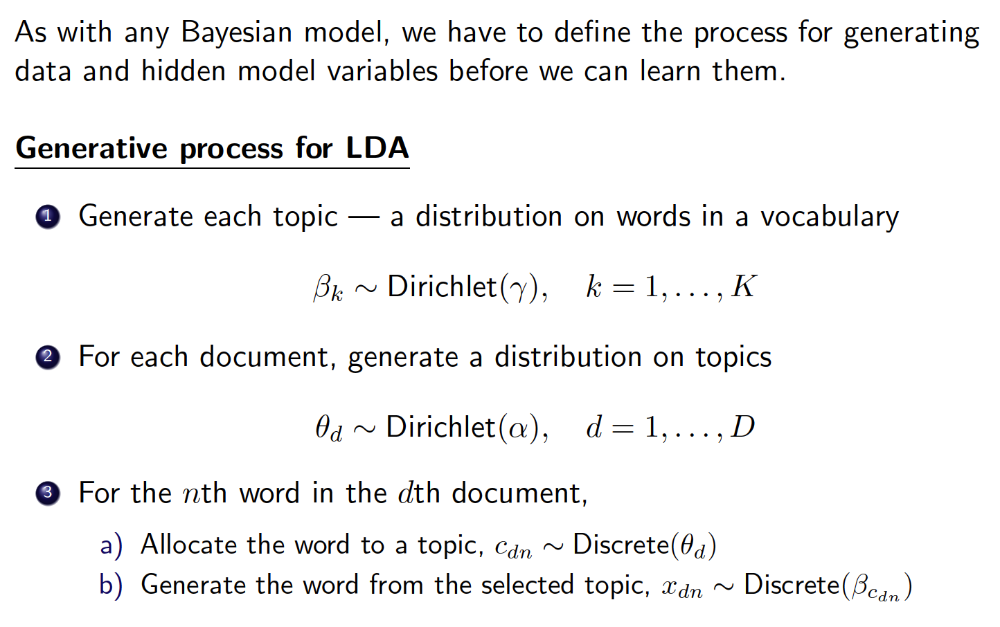
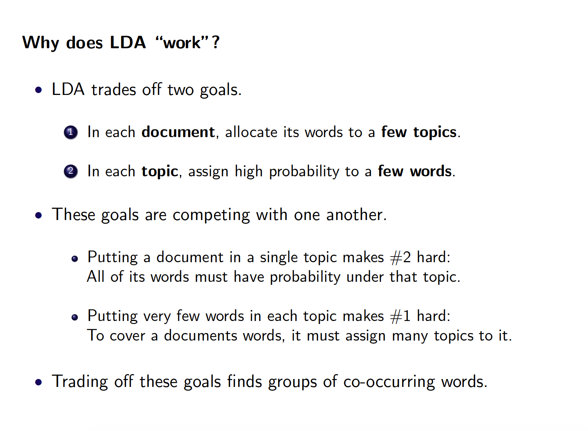

---
title: "Topic Modelling"
date: "11/9/2016"
output: html_document
---  
## References  

The tutorial is replicated from the [A topic model for movie reviews](https://cpsievert.github.io/LDAvis/reviews/reviews.html) with added comment.  

## Essential theories  
### 1. Text problems, Unsupervises, Bag-of-Words Model, Bayesian
**Order doesn't matter!**  


###2. Setup  
### Definitions:  
#### - Topics: Probability distributions on vocabulary   
A topic is like a collection of distributions on words. Different topics have different distributions of words.    

#### - Topic proportions: Probability distributions on the topics  
Like Issac Asimov's *The Last Question* definitely has a topic distribution different from, say Donald Trump's speech script.    

#### - Topic assignments: Assigns each observed word to a topic

###3. A Closer Look at the Model set-up  



#### Slides taken from Professor John Paisley's lecture EECS E6720 Bayesian Models for Machine Learning.

For full infromation on this course please check [here](http://www.columbia.edu/~jwp2128/Teaching/E6720/Fall2016/E6720Fall2016.html)

###4. Intuitively, why does it work? 



Again slides credit to Professor John Paisley.

## Topic Modelling in R  
#### And for the next tutorial I will be following the tutorial available online [here](https://cpsievert.github.io/LDAvis/reviews/reviews.html) 

##### Packages used
```{r setup}
data(reviews, package = "LDAvisData")

library(NLP)
library(tm)
library(lda)
library(LDAvis)
```

##### Pre-processing  
```{r}
stop_words <- stopwords("SMART")

# pre-processing:
reviews <- gsub("'", "", reviews)  # remove apostrophes
reviews <- gsub("[[:punct:]]", " ", reviews)  # replace punctuation with space
reviews <- gsub("[[:cntrl:]]", " ", reviews)  # replace control characters with space
reviews <- gsub("^[[:space:]]+", "", reviews) # remove whitespace at beginning of documents
reviews <- gsub("[[:space:]]+$", "", reviews) # remove whitespace at end of documents
reviews <- tolower(reviews)  # force to lowercase
```
 
##### Prepare the Inputs!  
**doc.list: A list of documents**
```{R}
# tokenize on space and output as a list:
doc.list <- strsplit(reviews, "[[:space:]]+")
length(doc.list)       # Length: number of documents
length(doc.list[[1]])  # A splited string of words
```

**term.table: vocabulary and their frequency**
```{R}
# compute the table of terms:
term.table <- table(unlist(doc.list))
term.table <- sort(term.table, decreasing = TRUE) 
head(term.table)      # Just to give an idea of how it looks like
```

Term table is a table of ALL terms that exist in our collections of documents. Here we still see words that do not bear much information, so we move on to delete them.

**Vocab: all distinct words**  
```{R}
# remove terms that are stop words or occur fewer than 5 times:
del <- names(term.table) %in% stop_words | term.table < 5
term.table <- term.table[!del]
vocab <- names(term.table)           # Vocab: a vector of all words
```

**"Now put the documents into the format required by the lda package"**
```{R}
# now put the documents into the format required by the lda package:
get.terms <- function(x) {
  index <- match(x, vocab)
  index <- index[!is.na(index)]
  rbind(as.integer(index-1), as.integer(rep(1, length(index))))
}
documents <- lapply(doc.list, get.terms)
documents[1]
```


`DOCUMENTS` is basically a large list of all docoments we have, each entry is a 2*length(document_i) matrix, recording which word in the `VOCAB` appeared in this document.

```{R}
# Compute some statistics related to the data set:
D <- length(documents)  # number of documents (2,000)
W <- length(vocab)  # number of terms in the vocab (14,568)
doc.length <- sapply(documents, function(x) sum(x[2, ]))  # number of tokens per document [312, 288, 170, 436, 291, ...]
N <- sum(doc.length)  # total number of tokens in the data (546,827)
term.frequency <- as.integer(term.table)  # frequencies of terms in the corpus [8939, 5544, 2411, 2410, 2143, 


# MCMC and model tuning parameters:
K <- 20
G <- 5000
alpha <- 0.02
eta <- 0.02
```

```{R,eval=FALSE}
# Fit the model:
library(lda)
set.seed(357)
t1 <- Sys.time()
fit <- lda.collapsed.gibbs.sampler(documents = documents, K = K, vocab = vocab, 
                                   num.iterations = G, alpha = alpha, 
                                   eta = eta, initial = NULL, burnin = 0,
                                   compute.log.likelihood = TRUE)
t2 <- Sys.time()
t2 - t1  # about 24 minutes on laptop

```


##### Visualization  
```{R,eval=FALSE}
theta <- t(apply(fit$document_sums + alpha, 2, function(x) x/sum(x)))
phi <- t(apply(t(fit$topics) + eta, 2, function(x) x/sum(x)))

MovieReviews <- list(phi = phi,
                     theta = theta,
                     doc.length = doc.length,
                     vocab = vocab,
                     term.frequency = term.frequency)
library(servr)
# create the JSON object to feed the visualization:
json <- createJSON(phi = MovieReviews$phi, 
                   theta = MovieReviews$theta, 
                   doc.length = MovieReviews$doc.length, 
                   vocab = MovieReviews$vocab, 
                   term.frequency = MovieReviews$term.frequency)

serVis(json, out.dir = 'vissample', open.browser = FALSE)
```

```{r,include=FALSE,eval=FALSE}
# 1. separate logistics  
# 2. Naive bayes  
# 3. Tree structure, generative, create music vocabulary; association mining  
# 4. Topic modelling: use features to predict topic profiles and then generate words
```