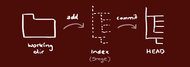
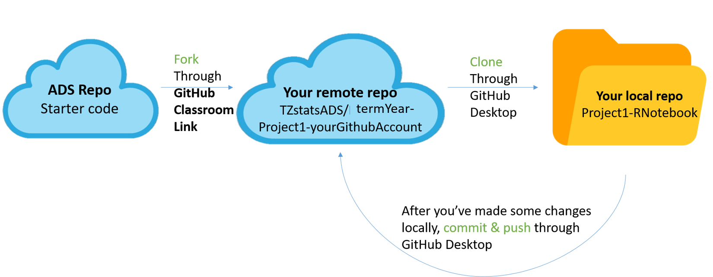

### GitHub Tutorial

#### Installation:
* Install GitHub Desktop: [https://desktop.github.com/]

#### Initialization:
* Create a new empty repository
	* create through GitHub desktop
	* create through GitHub website
* Create a repository from existing local folder
	* from desktop: drag the folder to github desktop
* Fork and Clone an existing git repository
   - from website
	
	
#### Work on GitHub Desktop
* Work in local repository
    * Pull to local repository
    * Add/Change files
    * Commit to local repository
    * Push to remote repository
	
* Work with collaboration
	* Fork and clone a (master) repository
	* Create a branch
		* Branching is the way to work on different parts of a repository at one time. It creates a snapshot of the original branch.
    * Make a commit
	* Open a pull request 
	* Merge pull request into the master branch
	* Pull to local repository

#### Workflow

*source:http://rogerdudler.github.io/git-guide/ *

For project 1:

#### Reference
* Tutorial for GitHub website: [https://guides.github.com/activities/hello-world/](https://guides.github.com/activities/hello-world/)
* Tutorial for GitHub desktop:
[https://help.github.com/en/desktop/getting-started-with-github-desktop](https://help.github.com/en/desktop/getting-started-with-github-desktop)
