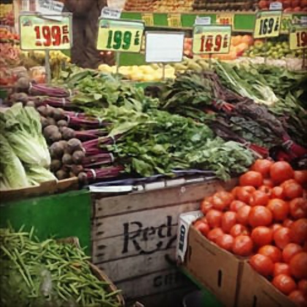

## Feature extraction, storage, running time (cost)

### Submission Time
```{r, echo=FALSE}
# run Results.R first
submitTime <- c(16, 55, 2, 112, 53, 106, 150, 0)
submitTime_label <- c("7:06PM", "7:45PM", "6:52PM", "8:42PM", "7:43PM", "8:36PM", "> 1 day", "In Time")

bar_time <- barplot(submitTime, main="Submission Time: Minutues from 6:50 PM",
        xlab="Team", ylab="Minutes", ylim=c(0, 160))
text(bar_time, submitTime+5, submitTime_label, cex=0.6)
axis(1, bar_time, labels=as.character(1:8))
```

### Baseline Feature Extraction Time
```{r, echo=FALSE}
# run Results.R first
RunningTime <- c(107.14, 1382.31, 115.63, 1184.97, 155.66, 99.28, 127.00, 361.29)
log_RunningTime <- log(RunningTime)
bar_time <- barplot(log_RunningTime, main="Feature Extraction Time (s)",
        xlab="Team", ylab="log(t)", ylim=c(0, 8))
text(bar_time, log_RunningTime+0.5, as.character(RunningTime), cex=0.8)
axis(1, bar_time, labels=as.character(1:8))
```


### Training Time
Baseline models: 

```{r, echo=FALSE}
# run Results.R first
RunningTime <- c(2606.44,
4011.68,
1776.94,
375.5,
389,
13338.71,
86400,
104.374)
log_RunningTime <- log(RunningTime)
bar_time <- barplot(log_RunningTime, main="Baseline Model Training Time (s)",
        xlab="Team", ylab="log(t)", ylim=c(0, 13))
RunningTimeText <- as.character(RunningTime)
RunningTimeText[7] <- '~ 1 day'
text(bar_time, log_RunningTime+0.5, RunningTimeText, cex=0.8)
axis(1, bar_time, labels=as.character(1:8))
```

Advanced models: 

```{r, echo=FALSE}
# run Results.R first
RunningTime <- c(169.45,
221.85,
642.69,
34.4,
86500,
143.98,
460.12,
242.513
)
log_RunningTime <- log(RunningTime)
bar_time <- barplot(log_RunningTime, main="Advanced Model Training Time (s)",
        xlab="Team", ylab="log(t)", ylim=c(0, 13))
RunningTimeText <- as.character(RunningTime)
RunningTimeText[5] <- '~ 3 days on CPU'
RunningTimeText[7] <- '460.12 on GPU'
text(bar_time, log_RunningTime+0.5, RunningTimeText, cex=0.8)
axis(1, bar_time, labels=as.character(1:8))
```


## Performance
### Baseline Prediction PSNR

```{r, echo=FALSE}
# data saved in Results.R
err_claimed <- c(
24.505,
24.685,
24.135,
24.882,
21.83,
25.8,
21.692,
26
)
err_adv_claimed <- rep(err_claimed, each=20)
CV_error_baseline <- c(
24.194,
24.32268,
24.1005,
24.7164,
26.7778,
24.79964,
24.12674,
NA
)
err_retrained <- rep(CV_error_baseline, each=20)
# load("label_eval.RData")
# load("pred_untuned.RData")
# ind_fun <- which(is.na(label_eval))
err_untuned <- c(
24.176,
24.3665,
23.8935,
12.9186,
20.3185,
23.7492,
23.8449,
23.1762
)
err_adv_untuned <- rep(err_untuned  , each=20)

type_names <- c("claimed", "untuned", "re-trained")
# team_names <- paste0("Team ", 1:12)
team_names <- 1:8
# load("output_proj3.RData")
err_adv_all <- data.frame(Team=rep(rep(team_names, each=20), times=3), 
  					  Type=rep(type_names, each=160),
						  Error= c(err_adv_claimed, err_adv_untuned, err_retrained)) #as.vector(t(output$err_adv_retrained))))

err_adv_all$Type <- factor(err_adv_all$Type, levels= type_names)
err_adv_all$Team <- factor(err_adv_all$Team, levels= team_names)


#err_adv_all$Error <- err_adv_all$Error

type_names <- c("claimed", "untuned", "re-trained")
team_names <- paste0("Team ", 1:10)

library(ggplot2)
(ggplot(err_adv_all, aes(y = Error, x = Team, fill = Type, colour = Type)) 
+ geom_boxplot(width=0.5,outlier.colour = NULL)
#+ scale_alpha_continuous(guide=FALSE, range=c(0.01,0.99))
+theme(axis.line = element_line(colour = "black"),
      panel.grid.major = element_blank(),
      panel.grid.minor = element_blank(),
      panel.border = element_rect(colour = "black", fill=NA),
      axis.text=element_text(size=12),
      axis.title=element_text(size=12),
      legend.text=element_text(size=12),
      legend.title=element_text(size=12, face="bold"),
      legend.position="bottom",
      strip.text.y = element_text(size = 13, face="bold"),
      panel.background = element_blank())
+ labs(title="Baseline Model PSNR", x="Team", y="PSNR")
+ scale_colour_brewer(palette = "Dark2", guide = FALSE)
+ scale_fill_brewer(palette = "Pastel2", labels=type_names, guide = guide_legend(title = "Type"))
+ geom_vline(xintercept = seq(1.5, 13.5, 1), linetype = "longdash", colour="lightgrey")) 

```

### Advanced Prediction Accuracy
Advanced models: XGBoost(1, 2, 3, 4, 6, 8), SRCNN(5, 7)

Best Performance: Car (5), Flower (2), Market (2)

```{r, echo=FALSE}
# data saved in Results.R
err_claimed <- c(
25.893,
25.968,
25.523,
24.213,
24.62,
25.8,
23.499,
24.63
)
err_adv_claimed <- rep(err_claimed, each=20)
CV_error_baseline <- c(
25.539,
26.1961,
25.686,
28.2682,
26.575,
25.8015,
26.8847,
36.327)
err_retrained <- rep(CV_error_baseline, each=20)
# load("label_eval.RData")
# load("pred_untuned.RData")
# ind_fun <- which(is.na(label_eval))
err_untuned <- c(
25.619,
25.625,
25.193,
23.428,
25.585,
22.850,
22.529,
23.272
)
err_adv_untuned <- rep(err_untuned  , each=20)

type_names <- c("claimed", "untuned", "re-trained")
# team_names <- paste0("Team ", 1:12)
team_names <- 1:8
# load("output_proj3.RData")
err_adv_all <- data.frame(Team=rep(rep(team_names, each=20), times=3), 
  					  Type=rep(type_names, each=160),
						  Error= c(err_adv_claimed, err_adv_untuned, err_retrained)) #as.vector(t(output$err_adv_retrained))))

err_adv_all$Type <- factor(err_adv_all$Type, levels= type_names)
err_adv_all$Team <- factor(err_adv_all$Team, levels= team_names)


err_adv_all$Error <- err_adv_all$Error

type_names <- c("claimed", "untuned", "re-trained")
team_names <- paste0("Team ", 1:8)

library(ggplot2)
(ggplot(err_adv_all, aes(y = Error, x = Team, fill = Type, colour = Type)) 
+ geom_boxplot(width=0.5,outlier.colour = NULL)
#+ scale_alpha_continuous(guide=FALSE, range=c(0.01,0.99))
+theme(axis.line = element_line(colour = "black"),
      panel.grid.major = element_blank(),
      panel.grid.minor = element_blank(),
      panel.border = element_rect(colour = "black", fill=NA),
      axis.text=element_text(size=12),
      axis.title=element_text(size=12),
      legend.text=element_text(size=12),
      legend.title=element_text(size=12, face="bold"),
      legend.position="bottom",
      strip.text.y = element_text(size = 13, face="bold"),
      panel.background = element_blank())
+ labs(title="Advanced Model PSNR", x="Team", y="PSNR")
+ scale_colour_brewer(palette = "Dark2", guide = FALSE)
+ scale_fill_brewer(palette = "Pastel2", labels=type_names, guide = guide_legend(title = "Type"))
+ geom_vline(xintercept = seq(1.5, 13.5, 1), linetype = "longdash", colour="lightgrey")) 
```


## Examples

### Car: img_0129.jpg
<center>


Figure 1. Example of Car

Upper-left: Ground Truth, Upper-right: LR Input, Lower-left: SRCNN, Lower-right: XGBoost


</center>


### Flower: img_0342.jpg
<center>


Figure 2. Example of Flower

Upper-left: Ground Truth, Upper-right: LR Input, Lower-left: XGBoost, Lower-right: SRCNN


</center>

### Market: img_0945.jpg
<center>





Figure 3. Example of Market

Upper-left: Ground Truth, Upper-right: LR Input, Lower-left: Best XGBoost, Lower-right: Worst XGBoost


</center>


  
  
  
  
  
  
  
  
 

