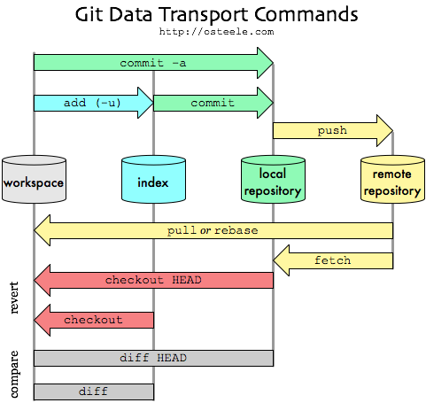

###GitHub Tutorial

#### Installation:
* Install Git: [http://git-scm.com/downloads] Windows & OS X
* Install GitHub Desktop: [https://desktop.github.com/]

#### Initialization:
* Create a new empty repository
	* create through github desktop
	* create through github website
	* create through terminal: `cd` to a new director and `git init`
* Create a repository from existing local folder
	* from desktop: drag the folder to github desktop
	* from terminal: `cd` to existing folder and `git init`. Commit and push all the files/changes (see below).
* Fork and Clone an existing git repository
	- [from desktop](https://help.github.com/desktop/guides/contributing/cloning-a-repository-from-github-to-github-desktop/)
	- from terminal: `git clone username@host/path/to/repository`

#### Work on GitHub Desktop
* Work in local repository
    * Add/Change files
    * Commit to local repository
	* Push to remote repository
	* Pull to local repository
* Work with collaboration
	* Fork and clone a (master) repository
	* Create a branch
		* Branching is the way to work on different parts of a repository at one time. It creates a snapshot of the original branch.
		* 
	* Make a commit
	* Open a pull request 
	* Merge pull request into the master branch
	* Pull to local repository

#### Git Glossary
* **commit**: record your changes to the local repository.
* **push**: update the remote repository with your local changes.
* **pull**: update your local repository to the newest commit
* **fork**: a request for GitHub to clone the project and registers it under your username; GitHub also keeps track of the relationship between the two repositories, so you can visualize the commits and pulls between the two projects (and other forks).
* **clone**: copy a repository into your local directory
* **branch**: branches allow you to build new features or test out ideas without putting the main project (master) at risk.
* **merge**: combine another branch in to the master
* **checkout**: switch between branches

#### Workflow

*source:http://rogerdudler.github.io/git-guide/ *
