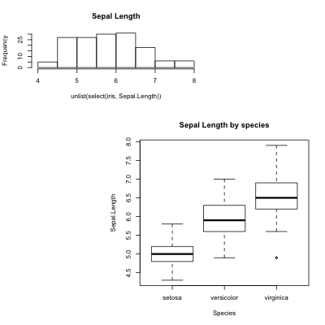

# More plots in R

In this tutorials, I give some simple examples on 

## Multiple plots in one page
First we load the dataset. 
```{r}
library(dplyr)
data(iris)
```

`layout()` is a basic and useful function to specify flexible layout of multiple plots on a single page. 

```{r}
layout(matrix(c(1,1,0,0,2,2,0,2,2), 3, 3, byrow=T))
layout.show(2)
```

Now we can add some plots to this layout. 
```{r}
layout(matrix(c(1,1,0,0,2,2,0,2,2), 3, 3, byrow=T))
hist(unlist(select(iris, Sepal.Length)), main="Sepal Length")
plot(Sepal.Length~Species, data=iris, main="Sepal Length by species")
```


## Export your plot. 
When you export your figure, you need setup the aspect and size of your export file and setup any necessary graphic parameters. 

```{r}
png("figs/example.png", width=400, height=400)
layout(matrix(c(1,1,0,0,2,2,0,2,2), 3, 3, byrow=T))
hist(unlist(select(iris, Sepal.Length)), main="Sepal Length")
plot(Sepal.Length~Species, data=iris, main="Sepal Length by species")
dev.off()
```

Using this exported file, you can embed the figure into your Rmarkdown file.



## Transparent colors
There are multiple ways of setting transparent colors in R. Here we use the `rgb()` function option. 

```{r}
layout(1)
breaks.use=seq(4,8, 0.5)
SL.hist.setosa=hist(unlist(
                  iris%>%
                    filter(Species=="setosa")%>%
                    select(Sepal.Length)),
                  breaks=breaks.use, plot=F)
SL.hist.versicolor=hist(unlist(
                  iris%>%
                    filter(Species=="versicolor")%>%
                    select(Sepal.Length)),
                  breaks=breaks.use, plot=F)
SL.hist.virginica=hist(unlist(
                  iris%>%
                    filter(Species=="virginica")%>%
                    select(Sepal.Length)),
                  breaks=breaks.use, plot=F)
plot(SL.hist.setosa, col=rgb(0,0,1,1/4), xlim=c(4,8), 
     main="Sepal Length by species",
     xlab="Sepal length")  
plot(SL.hist.versicolor, col=rgb(1,0,0,1/4), add=T)
plot(SL.hist.virginica, col=rgb(0,1,0,1/4), add=T)
```
