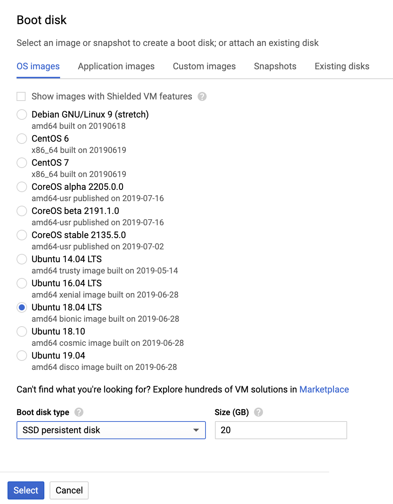
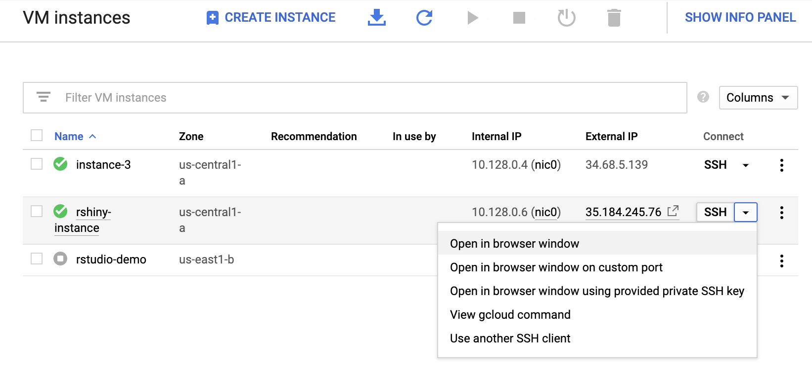
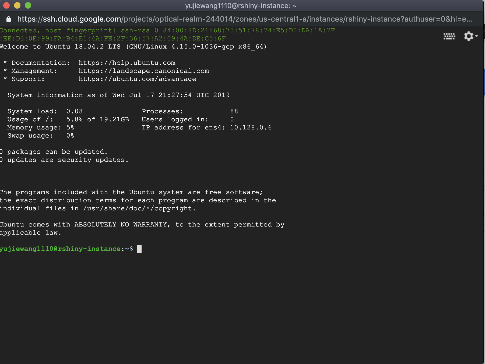
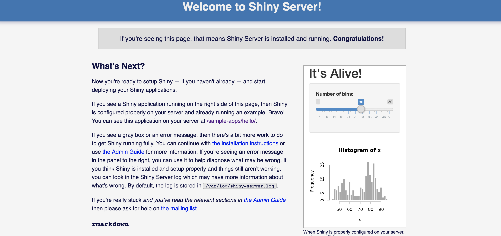

# Deploy Rshiny on Google Cloud Platform
This toturial is based on [GCP Documenation](https://cloud.google.com/docs/) and modified from [Luis Henrique Zanandréa Paese's tutorial](https://github.com/paeselhz/RStudio-Shiny-Server-on-GCP) on  Github.

### Step 0: Register a GCP Account and Create a New Project
- Google offers $300 credit and 12-month free trail for GCP product. Register [here](https://cloud.google.com/free).
- To create a new project: ([toturial](https://cloud.google.com/resource-manager/docs/creating-managing-projects)):
    1. Go to the [Manage resources page](https://console.cloud.google.com/cloud-resource-manager?_ga=2.176258477.-941251705.1560576658&_gac=1.187635930.1563387861.Cj0KCQjwjrvpBRC0ARIsAFrFuV9Cbk-cF3lpzMvJ6EdIll_r55LzfQJRp59noPQLWoCP4S1C_eIuFaAaAqWlEALw_wcB) in the GCP Console. 
    2. On the Select organization drop-down list at the top of the page, select the organization in which you want to create a project. If you are a free trial user, skip this step, as this list does not appear.
    3. Click Create Project.
    4. In the New Project window that appears, enter a project name and select a billing account as applicable.
    5. If you want to add the project to a folder, enter the folder name in the Location box.
When you're finished entering new project details, click Create.

### Step 1: Create a VM instance
- Go to [console](https://console.cloud.google.com).
- From the side bar, select **Compute Engine**, then **VM instances**.
- Click **CREATE INSTANCE**:
    1. Enter instance name, select region and zone.
    2. Under **Boot disk** section, you can choose the operation system to install. Here is my selection.     
    3. Under **Identity and API access** section, check **Allow full access to all Cloud APIs**
    4. Under **Firewall** section, check **allow HTTP traffic**.
    5. Click **Create**.
  
### Step 2: Set up VM instances
- Go to [VM instances page](https://console.cloud.google.com/compute/instances).
- Check the instance you just created and click the run button on the top.
- Click **SSH** and select **Open in browser window**. 

A window will pop up:

* To allow ports for Rstudio Server and Shiny Server, copy the following commands and paste in the pop-up window:
    + For the RStudio Connection:
    ```sh
    sudo gcloud compute firewall-rules create rstudio-conn --allow=tcp:8787
    ```
    + For the Shiny Server Connection:
    ```sh
    sudo gcloud compute firewall-rules create shiny-conn --allow=tcp:3838
    ```

### Step 3: Install R on the Virtual Machine
- Check updates of your Virtual Machine:
```sh
sudo apt-get update
sudo apt-get upgrade
```
- The code chunk below adds a line to the repository list, then passes a key for the Ubuntu server to download R, updates the existing packages, and installs r-base and r-base dev.
```sh
sudo sh -c 'echo "deb https://cloud.r-project.org/bin/linux/ubuntu bionic-cran35/" >> /etc/apt/sources.list'
sudo apt-key adv --keyserver keyserver.ubuntu.com --recv-keys E084DAB9
sudo apt-get update
sudo apt-get install r-base r-base-dev
```
- A few features won't work using only the r-base, since the packages are based on other programs as well, so to cover a few of those, below are the codes used to install the software needed.
    - Spatial Libraries:
    ```sh
    sudo apt-get install libgeos-dev libproj-dev libgdal-dev
    ```
    - Tidyverse Universe:
    ```sh
    sudo apt-get install libcurl4-openssl-dev libssl-dev libxml2-dev
    ```
    - other:
    
    ```sh
    sudo add-apt-repository -y ppa:opencpu/jq
    sudo apt-get update
    sudo apt-get install libjq-dev
    
    sudo apt-get install libudunits2-dev 
    sudo apt-get install libprotobuf-dev
    sudo apt-get install libv8-dev
    sudo apt-get install protobuf-compiler
    ```

- Now, you can run R on your virtual machine.
```sh
sudo -i R
```
- Now that we have R open at the terminal of our virtual machine, we might as well install a few packages that will be useful with Shiny, such as the shiny package, the RMarkdown package, and dplyr.
To do that, at the command line in R type:
```sh
install.packages(c('shiny', 'rmarkdown', 'dplyr'))
```
**Note** that all packages required for your Shiny App should be installed here(in R) instead of Rstudio Server. This process might take a while. Once installation is complete, leave the R command line:
```sh
quit()
```

### Step 4: Install RStudio Server on the Virtual Machine
- The following code will install gdebi, download the .deb file that contains the RStudio server file, and execute it.
```sh
sudo apt-get install gdebi-core
wget https://download2.rstudio.org/rstudio-server-1.1.456-amd64.deb
sudo gdebi rstudio-server-1.1.456-amd64.deb
```
- To verify if the installation went correctly, access
```sh
http://[your_external_ip]:8787
```
If everything is fine, you'll find this screen:
- After this, you'll need to create a user to use the RStudio hosted on your virtual machine, so you go back to the Linux terminal, and type:
```sh
sudo adduser YOUR_USER_NAME
```
- save your username and passward for further usage.

### Step 5: Install Rshiny Server on the Virtual Machine
- To install the Shiny Server, we'll install the gdebi to execute the installation, if you already have installed gdebi before, you can discard the first line. The second line is to download the file of installation, and the third one is to execute the installation.
```sh
sudo apt-get install gdebi-core
wget https://download3.rstudio.org/ubuntu-14.04/x86_64/shiny-server-1.5.7.907-amd64.deb
sudo gdebi shiny-server-1.5.7.907-amd64.deb
```
```
If everything is fine, you'll see this screen:

- You might set full edit permissions to the folder containing shiny-server folders using the following command:
```sh
sudo chmod 777 -R /srv/shiny-server/
```

### Step 6: Reserve a Static External IP
- To Reserve a static external IP address:
- Assign your static external IP address to your VM instance.
    1. Go to [networking page](https://console.cloud.google.com/networking/addresses). You will find an **ephemeral** address is used by your current VM instance.
    2. Under **Type** column, select **static**. The ephemeral address becomes static.
    3. Enter a name for the new static IP address and click reserve.

- To verify, try:
```sh
http://your_new_static_external_ip:3838
```

### Step 7: Develop Your Rshiny App
- Access http://your_new_static_external_ip:8787 and login. Username and passward are set up in Step 4.
- Create a new Rshiny Web Application, enter **Application_name**, your project is now located on the virtual machine with the path:
```sh
/home/YOUR_USER_NAME/Application_name.
```

- Develop Rshiny App, here are useful documents:
    - [http://shiny.rstudio.com/](http://shiny.rstudio.com/)
    - [https://docs.rstudio.com/shiny-server/](https://docs.rstudio.com/shiny-server/)
    - Tutorial on project 2 - [Introduction to shiny app ](https://cdn.rawgit.com/TZstatsADS/ADS_Teaching/2551e1df/Projects_startercodes/Project2_OpenData/doc/Tutorial2.html#1)

### Step 8: Publish Your Rshiny App
- Notice that your Shiny application is located in the folder with path:
```sh
/home/YOUR_USER_NAME/Application_name
```
- Copy all of your project files to the folder for the shiny-server:
```sh
cp -R /home/YOUR_USER_NAME/Application_name /srv/shiny-server
```
- Your Shiny App is now published. If you keep you virtual machine instance running, everyone could see your App through:
```sh
http://your_new_static_external_ip:3838/Application_name/
```

  
 


 


